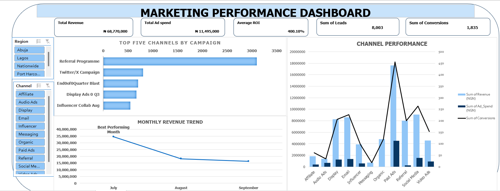
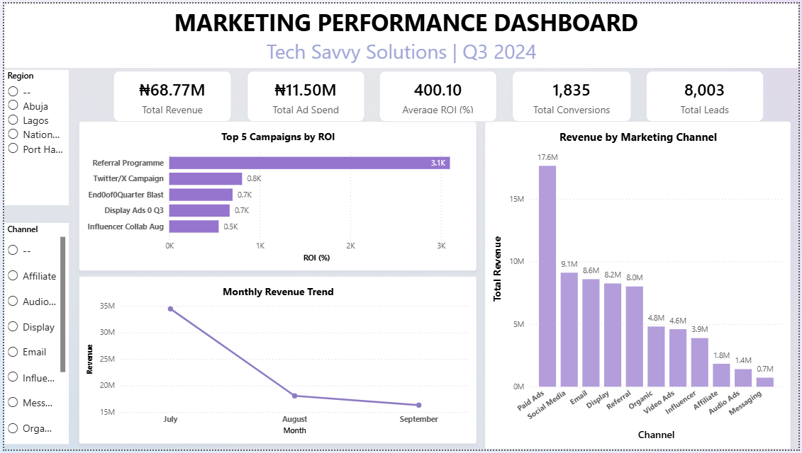

# 📊 Q3 Marketing Performance Analysis

## Project Overview

This project was completed as part of the **Skill2Scale Data Analytics Virtual Internship**, where I worked as a Data Analyst for a simulated client, **Tech Savvy Solutions**.

The objective was to transform raw Q3 marketing campaign data into actionable business insights through data cleaning, KPI analysis, dashboard development, forecasting, and strategic recommendations that support informed business decisions. The project covers the complete analytics workflow—from data cleaning and KPI calculation to dashboard development, forecasting, and business reporting.


---

## Business Problem

Tech Savvy Solutions had accumulated marketing campaign data that was inconsistent, incomplete, and difficult to analyze. The business needed a structured analytics solution to evaluate campaign performance, identify growth opportunities, and support strategic planning for the next quarter.

---

## Business Questions

This project answers the following business questions:

- Which marketing campaigns delivered the highest Return on Investment (ROI)?
- Which marketing channel generated the most revenue?
- How did revenue change across July, August, and September?
- Why did some campaigns outperform others?
- What relationship exists between advertising spend and leads generated?
- What revenue can be expected in Q4 based on Q3 performance?
- What strategic recommendations can improve future campaign performance?

---

## Project Workflow

### Week 1 – Data Cleaning & Preparation

- Cleaned and validated campaign data
- Removed duplicates and handled missing values
- Standardized inconsistent formats
- Recalculated missing ROI values
- Developed a Data Dictionary
- Created a Folder Structure SOP
- Performed exploratory data analysis

### Week 2 – Dashboard Development

Developed an interactive Microsoft Excel dashboard featuring:

- KPI Cards
- Revenue by Channel
- Top & Bottom Campaign Performance
- Monthly Revenue Trend
- Revenue and ROI Analysis
- Interactive Pivot Tables and Charts

### Week 3 – Business Analysis

Performed advanced analytics including:

- Monthly Trend Analysis
- Ad Spend vs Leads Correlation Analysis
- Customer/Campaign Segmentation
- Q4 Revenue Forecasting
- Competitor Comparison
- Strategic Business Recommendations

### Week 4 – Executive Reporting

Prepared:

- Executive Analytics Report
- Business Insights Report
- Business Optimisation Proposal
- Portfolio Presentation
- Project Documentation

---

## Tools & Skills

### Tools

- Microsoft Excel
- SQL
- Power BI 
- GitHub

### Skills

- Data Cleaning
- Data Analysis
- Dashboard Development
- KPI Reporting
- Data Visualization
- Business Reporting
- Forecasting
- Data Storytelling

---

## Key Performance Indicators (KPIs)

## Dashboard Preview
## Key Insights

- July generated the highest revenue (₦34.44 million), with performance declining in August and September.
- Advertising spend showed a weak positive correlation with leads (r = 0.448), indicating that higher spending alone did not guarantee better campaign performance.
- Campaign segmentation revealed performance differences across campaign groups.
- Competitor comparison provided additional context for evaluating campaign effectiveness.
- Q4 revenue projections were developed using Q3 historical trends and clearly documented assumptions.

---

### Microsoft Excel Dashboard



### Power BI Dashboard




---

## Business Recommendations
Based on the analysis, the following recommendations were made:

- Invest more resources in campaigns with consistently high ROI.
- Standardize reporting processes to improve efficiency and reduce manual effort.
- Consider campaign quality, audience targeting, and channel performance alongside advertising spend when making future marketing decisions.
- Monitor key performance indicators regularly to support data-driven decision-making.


```
## Repository Structure

text
📁 Data
📁 Documentation
📁 Excel Dashboard
📁 Images
📁 Power BI Dashboard
📁 Presentation
📁 Reports
```

## About Me

Hi, I'm **Glory Ekpenyong**, a Data Analyst passionate about transforming operational data into actionable business insights that support informed decision-making and business growth.

### Connect with Me

- LinkedIn: *https://www.linkedin.com/in/glory-maurice-9309b43a2/*
- GitHub: *https://github.com/Glory601/*
